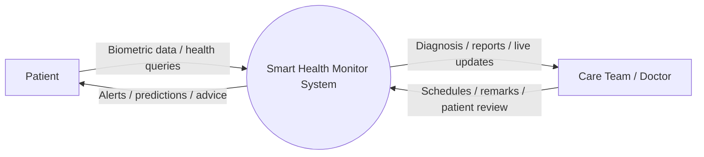
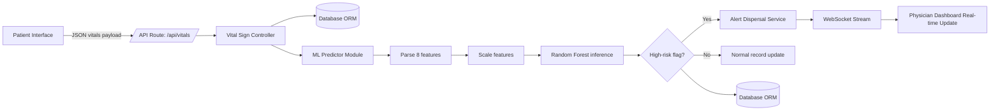

# SMART HEALTH MONITOR SYSTEM
## A University Level Project Report

**Submitted in partial fulfillment of the requirements for the degree**

---

## CONTENTS
**ABSTRACT**
**1. INTRODUCTION**
1.1 SYSTEM SPECIFICATION
&nbsp;&nbsp;&nbsp;&nbsp;1.1.1 HARDWARE CONFIGURATION
&nbsp;&nbsp;&nbsp;&nbsp;1.1.2 SOFTWARE SPECIFICATION
**2. SYSTEM STUDY**
2.1 EXISTING SYSTEM
&nbsp;&nbsp;&nbsp;&nbsp;2.1.1 DESCRIPTION
&nbsp;&nbsp;&nbsp;&nbsp;2.1.2 DRAWBACKS
2.2 PROPOSED SYSTEM
&nbsp;&nbsp;&nbsp;&nbsp;2.2.1 DESCRIPTION
&nbsp;&nbsp;&nbsp;&nbsp;2.2.2 FEATURES
**3. SYSTEM DESIGN AND DEVELOPMENT**
3.1 FILE DESIGN
3.2 INPUT DESIGN
3.3 OUTPUT DESIGN
3.4 CODE DESIGN
3.5 SYSTEM DEVELOPMENT
&nbsp;&nbsp;&nbsp;&nbsp;3.5.1 DESCRIPTION OF MODULES
**4. SYSTEM IMPLEMENTATION**
**5. CONCLUSION**
5.1 FUTURE ENHANCEMENT
**6. BIBLIOGRAPHY**
**APPENDICES**
A. DATA FLOW DIAGRAM
B. USE CASE DIAGRAM
C. SAMPLE CODING
D. SAMPLE OUTPUT

---

## ABSTRACT

The rapid advancement of digital healthcare and Internet of Things (IoT) technologies has necessitated the development of intelligent, proactive, and continuous monitoring systems. The "Smart Health Monitor System" is a comprehensive, web-based, AI-powered healthcare platform designed to bridge the gap between patients, healthcare providers, and real-time medical data. This project aims to transition healthcare management from a reactive paradigm—where intervention occurs only post-symptom manifestation—to a proactive model that predicts and prevents health deterioration. 

The core of the system revolves around the real-time acquisition and analysis of vital signs, including heart rate, blood pressure, oxygen saturation (SpO2), and body temperature. Utilizing a Random Forest machine learning classifier, the system processes these vital parameters to predict potential health risks, assigning patients to low, medium, or high-risk categories with calculated probabilities. Furthermore, the system incorporates an intelligent chatbot driven by the Google Gemini AI API, acting as a virtual health assistant capable of providing contextual medical advice based on the patient's real-time data.

The application architecture follows a modular, microservices-inspired design pattern using the Flask framework. State management and bidirectional communication are handled via WebSocket protocols to ensure zero-latency vital sign updates. The system accommodates complex multi-role workflows—incorporating Patient, Doctor, and Administrator personas—enabling seamless appointment scheduling, continuous mental and physical health tracking, family member management, and automated emergency SOS alerts. The resulting artifact is an easily deployable, secure, and highly scalable system that significantly augments the efficiency of clinical monitoring and empowers patients to take control of their personal health journey.

---

## 1. INTRODUCTION

The traditional healthcare system predominantly relies on periodic physical consultations. While effective for acute conditions, this approach falls short in managing chronic diseases and preventing sudden cardiac or respiratory failures. In contemporary medical practice, continuous monitoring and early prognostic evaluations are pivotal. The Smart Health Monitor System was conceptualized against this backdrop, serving as an integrated telemedicine and remote patient monitoring (RPM) solution. 

This project intends to deliver an end-to-end framework that captures physiological metrics, utilizes artificial intelligence to infer systemic risks, and triggers automated clinical workflows. The integration of modern web technologies with machine learning provides an interface where patients can actively view their dynamic "Health Score," while physicians receive prioritized alerts regarding critically ill individuals. The overarching objective is to reduce healthcare costs, minimize hospital readmission rates, and provide intelligent, 24/7 medical oversight.

### 1.1 SYSTEM SPECIFICATION

To ensure the optimal performance, responsiveness, and reliability of the Smart Health Monitor System, the following hardware and software specifications are required. The system operates on a client-server architecture, allowing thin clients to access complex processing capabilities securely over a network.

#### 1.1.1 HARDWARE CONFIGURATION

The system is designed to be lightweight on the client-side but requires standard server infrastructure to handle concurrent WebSocket connections and machine learning inference.

**Server-Side Hardware Requirements:**
* **Processor:** Intel Core i5 / AMD Ryzen 5 or equivalent (Minimum); Intel Core i7 / Xeon or higher (Recommended for production environments).
* **Memory (RAM):** 8 GB Minimum; 16 GB or higher recommended for managing multiple ML processes and SocketIO concurrent connections.
* **Storage Space:** 50 GB SSD minimum for storing database records, medical report PDFs, and application logs.
* **Network Integration:** High-speed broadband connection to reliably serve API endpoints and establish stable WebSocket connections.

**Client-Side Hardware Requirements:**
* **Processor:** Any modern mobile or desktop processor capable of running a modern web browser.
* **Memory (RAM):** 2 GB Minimum.
* **Peripherals:** Optional IoT-enabled health sensors (e.g., smartwatches, wireless blood pressure cuffs) for live data transmission.

#### 1.1.2 SOFTWARE SPECIFICATION

The software stack utilizes robust, enterprise-grade open-source technologies to ensure security, scalability, and ease of deployment.

* **Operating System Environment:** Windows 10/11, macOS, or any Linux Distribution (Ubuntu 20.04 LTS or newer recommended for server deployment).
* **Programming Language:** Python 3.8 or higher.
* **Web Framework:** Flask 3.0.0 (chosen for its microframework flexibility and Blueprint routing capabilities).
* **Database Management System:** SQLite 3 (for development and prototyping); PostgreSQL 15.x / MySQL 8.x (for production environments).
* **Object-Relational Mapping (ORM):** SQLAlchemy 2.0.23.
* **Machine Learning & Data Science Libraries:** scikit-learn 1.4.0, NumPy 1.26.3, pandas 2.1.4.
* **Artificial Intelligence Interface:** Google Generative AI / Gemini API (`google-genai`).
* **Real-time Communication Protocol:** Flask-SocketIO 5.3.5, leveraging Eventlet/Threading asynchronous modes.
* **Frontend Technologies:** HTML5, CSS3, JavaScript (ES6+), integrating responsive CSS techniques and asynchronous Fetch APIs.
* **Security & Authentication:** Werkzeug Security, Flask-Login, PyJWT bindings.

---

## 2. SYSTEM STUDY

### 2.1 EXISTING SYSTEM

For decades, the standard procedure for health monitoring has been primarily episodic. The existing state of personal health monitoring typically involves fragmented tools that do not communicate with one another.

#### 2.1.1 DESCRIPTION

Current personal healthcare technologies can be broadly categorized into:
1. **Clinical Electronic Health Records (EHR) Systems:** Systems like Epic or Cerner that are confined entirely within hospital local area networks. They are exclusively accessible to medical staff and offer no real-time patient-facing monitoring outside the clinical setting.
2. **Consumer Wearables:** Devices such as Apple Watches or Garmin fitness trackers. While they collect continuous data, their companion applications generally provide only basic statistical summaries without clinical interpretation, risk forecasting, or automated pathways to connect with a physician.
3. **Telehealth Platforms:** Applications like Zocdoc or Practo that focus solely on establishing a video call or booking an appointment, lacking integration with the patient's continuous physiological data or predictive AI.

#### 2.1.2 DRAWBACKS

The primary deficiencies in the current existing systems are:
* **Reactive Nature of Care:** Systems record a patient's historical deterioration rather than predicting an impending crisis.
* **Siloed Medical Data:** Vital signs, appointment schedules, and medical histories reside in disjointed applications requiring manual reconciliation.
* **Absence of Intelligent Triage:** Wearables alert users of an abnormal heart rate, but fail to analyze the combination of heart rate, blood pressure, and age to recommend specific medical interventions.
* **High Latency in Emergency Response:** Current standalone applications lack automated SOS protocols that inherently share precise medical context and GPS location with emergency contacts and specific care teams simultaneously.
* **Ignorance of Mental Health:** Most physical health monitors entirely neglect psychological well-being, failing to capture the holistic health profile of the patient.

### 2.2 PROPOSED SYSTEM

To overcome the limitations of the existing systems, the "Smart Health Monitor System" proposes a paradigm shift towards an integrated, predictive, and patient-centric healthcare platform.

#### 2.2.1 DESCRIPTION

The proposed system consolidates continuous vital tracking, machine learning risk evaluation, and telehealth logistics into a single, unified ecosystem. Upon user registration, patients can manually log or simulate IoT insertion of their vitals. The backend immediately processes these vitals through a pre-trained Random Forest algorithm to evaluate cardiovascular and metabolic risk probabilities.
If a high-risk anomaly is detected, the system automatically dispatches priority alerts to the patient's dashboard, notifies their registered care team, and recommends specific specialists based on the anomalous biomarkers (e.g., referring to a Cardiologist if systolic pressure > 160). Simultaneously, an integrated Gemini-powered AI chatbot remains available around the clock to translate complex prediction metrics into easily understandable medical advice.

#### 2.2.2 FEATURES

* **AI-Driven Predictive Analytics:** Utilizes `scikit-learn` to execute inference on an 8-parameter clinical dataset, outputting probabilistic risk levels with contributing factor analysis.
* **Bidirectional Real-Time Communication:** Telemetry data is broadcast instantly to the physician's and patient's dashboards via WebSockets (`Flask-SocketIO`).
* **Composite Health Scoring Mechanism:** Calculates a dynamic metric out of 100, deriving sub-scores for respiratory, cardiovascular, and metabolic efficiency, visualized as historical trend charts.
* **Context-Aware AI Chatbot:** Extends traditional Large Language Models by injecting the user's latest clinical profile into the prompt context, yielding strictly personalized and relevant medical guidance.
* **Smart Specialist Recommendation Engine:** Maps diagnosed anomalies to specific medical disciplines and filters available doctors by match score and schedule availability.
* **Automated Emergency SOS Protocols:** Integrates instant alert mechanisms that bypass standard queues, registering acute events directly to administrative and emergency contact dashboards.
* **Comprehensive PDF Report Generation:** Clinically formatted summaries dynamically generated through `ReportLab` detailing prediction history, vital charts, and physician remarks.

---

## 3. SYSTEM DESIGN AND DEVELOPMENT

### 3.1 FILE DESIGN

Data persistence is managed through a Relational Database Management System (RDBMS) facilitated by SQLAlchemy ORM. The schema is highly normalized to eliminate redundancy and maintain referential integrity.

**Core Entities and ER Relationships:**
1. **Users Table:** The central entity handling authentication, containing role enumerations (`admin`, `doctor`, `patient`) and hashed credentials.
2. **DoctorProfiles Table:** Maintains a 1-to-1 relationship with the Users table for accounts with a `doctor` role, storing licensing numbers, consultation fees, and availability arrays.
3. **VitalSigns & HealthPredictions Tables:** Maintain a 1-to-Many relationship with the Patient. These tables track timestamps (`recorded_at`, `predicted_at`) ensuring chronological trend analysis.
4. **Appointments Table:** Serves as an associative entity establishing a Many-to-Many relationship between Patients and Doctors, containing temporal bounds, urgency flags, and resolution statuses.
5. **Alerts & MedicalReports Tables:** Associated with patients to maintain longitudinal logs of clinical events and generated documentation.

### 3.2 INPUT DESIGN

Input modules are strictly validated to prevent SQL injection and ensure clinical data integrity prior to machine learning processing.

* **Forms:** Authenticated forms utilizing CSRF protection and strictly typed HTML5 inputs.
* **API Endpoints:** RESTful APIs process JSON payloads. For instance, the `/api/vitals/record` endpoint enforces numeric constraints on physical parameters (e.g., verifying SpO2 bounds between 0 and 100).
* **Sanitization:** User inputs via the AI Chatbot are purged of executing characters to prevent cross-site scripting (XSS) in the chat interface.

### 3.3 OUTPUT DESIGN

System outputs are customized based on the role of the requesting user.

* **Patient Dashboard UI:** Renders visual components such as gauges for Health Scores, colored badges for Risk Levels (Green/Yellow/Red), and dynamic tables displaying the prescription and alert history.
* **Data Visualization:** Employs front-end graphing libraries to render multi-series line charts representing the time-series forecasting of cardiovascular trends.
* **Downloadable Assets:** Clinical Medical Reports are streamed directly as `application/pdf` MIME types, formatting complex nested JSON prediction data into readable clinical summaries.

### 3.4 CODE DESIGN

The system follows a strict **Model-View-Controller (MVC)** architectural pattern adapted for Flask.

* **Models:** Housed in `database/models.py`. Encapsulate the database fields and constraints.
* **Views (Routes):** Fractured into Pluggable Blueprints (e.g., `auth.py`, `vitals.py`, `predictions.py`). This guarantees decoupled logic, where the authentication blueprint is completely independent of the machine learning inference blueprint.
* **Controllers (Services):** Dedicated module directories (`services/`) abstract complex business logic, such as the `alert_service.py` dictating threshold trigger logic, keeping routing files lean and maintainable.

### 3.5 SYSTEM DEVELOPMENT

The development life cycle followed an Agile methodology. Initial iterations established the authentication and fundamental database schemas. Subsequent sprints concentrated on the integration of ML algorithms, followed by real-time WebSocket capabilities, and finalized with the UI/UX enhancements.

#### 3.5.1 DESCRIPTION OF MODULES

**1. Authentication & Profiling Module**
Controls session states and role-based access control (RBAC). It prevents concurrent sessions on multiple devices for the same user, encrypts passwords using BCrypt/Werkzeug, and permits extensive privacy customization via the `UserSettings` relationship.

**2. Telemetry & Vital Acquisition Module**
Processes incoming biometric streams. Whether passed manually via web forms or simulated iteratively over POST requests, this module sanitizes data, commits it to the SQLite engine, and instructs the `AlertService` to evaluate the measurements against predetermined physiological boundaries.

**3. Machine Learning & Forecasting Module**
Built using `scikit-learn`, this module instantiates a `RandomForestClassifier`. Upon initialization, it trains against an expansive synthetic dataset representing myriad clinical states. During runtime, it ingests an 8-dimensional feature vector, scales it using a saved `StandardScaler`, and returns deterministic probability distributions representing disease risk.

**4. Conversational AI Assistant Module**
Serves as an abstraction layer over the Google Gemini Large Language Model. The module queries the patient's database records to compile a "Medical Context Header." This header is prepended hiddenly to the user's question, forcing the LLM to output highly specific, medically contextualized, and safe lifestyle advice.

**5. Automated Logistics & Triage Module**
Responsible for the Appointment and Doctor Recommendation functionalities. By analyzing the "Predicted Conditions" array outputted by the ML Module, it semantically maps patient needs to physician specializations (e.g., "Hypertension Risk" mapped to "Cardiologist") and calculates match scores algorithmically.

---

## 4. SYSTEM IMPLEMENTATION

Implementation involved configuring a versatile deployment environment capable of running both synchronized HTTPS requests and asynchronous WebSocket streams concurrently.

**Implementation Environment:**
The application relies on Gunicorn acting as a WSGI HTTP Server. Because of the use of `Flask-SocketIO`, the server utilizes the `eventlet` asynchronous worker class to handle thousands of concurrent client connections without memory bloat.

**Execution Flow:**
1. System reads environment configurations from the `.env` file containing confidential API keys and database URIs.
2. The Application Factory (`create_app`) boots up, mounting all 20+ Blueprints.
3. The DB ORM models translate and create missing SQL tables automatically.
4. The `model_trainer.py` executes; if a serialized version of the ML model (`risk_predictor.pkl`) is missing or outdated, it mathematically retrains the Random Forest and serializes it to the local disk.

**Testing Methodologies:**
Unit testing isolated singular service elements (e.g., verifying `health_analysis.py` yields correct composite scores). Integration testing verified data flows, confirming that triggering a simulated IoT vital sign mathematically propagated alterations through the machine learning model, generating alerts, and appearing visibly on the frontend without a page refresh.

---

## 5. CONCLUSION

The Smart Health Monitor System represents a substantial leap forward in telehealth architecture. By successfully intersecting robust backend engineering with machine learning and generative artificial intelligence, the platform demonstrates that continuous, proactive health monitoring is not only technically feasible but highly scalable. The system resolves the core dilemma of modern healthcare by autonomously transforming raw, continuous biometric data into actionable clinical insights. Through immediate alert dispersal, an intelligent chatbot interface, and automated appointment logistics, the project dramatically enhances the accessibility, speed, and precision of patient-caregiver interactions.

### 5.1 FUTURE ENHANCEMENT

While the current system establishes a dominant technical baseline, the software engineering roadmap identifies numerous avenues for future capability expansion:

1. **Hardware Sensor API Integration:** Transitioning from simulated IoT to developing direct Bluetooth Low Energy (BLE) bindings to interface natively with commercially available smartwatches (e.g., Apple HealthKit, Google Fit API).
2. **Deep Learning Upgrades:** Upgrading the standard Random Forest model to an LSTM (Long Short-Term Memory) neural network utilizing TensorFlow, which natively accommodates sequential time-series data for dramatically improved predictive accuracy.
3. **Telemedicine Video Functionality:** Implementing WebRTC architectures to facilitate instantaneous peer-to-peer, encrypted video consultations natively within the browser window.
4. **Pharmaceutical Supply Chain Linkage:** Integrating with pharmacy APIs to allow physicians to prescribe medications directly through the app, with automatic home-delivery routing.
5. **Decentralized Data Security:** Exploring blockchain protocols to guarantee the immutable, anonymized management of EHR data for enhanced global compliance (HIPAA/GDPR).

---

## 6. BIBLIOGRAPHY

1. Pallets Projects. (2023). *Flask Documentation (v3.0.x)*. Retrieved from https://flask.palletsprojects.com/
2. Pedregosa, F., et al. (2011). *Scikit-learn: Machine Learning in Python*. Journal of Machine Learning Research, 12, 2825-2830.
3. Grinberg, M. (2023). *Flask-SocketIO Documentation*. Retrieved from https://flask-socketio.readthedocs.io/
4. Bayer, M. (2023). *SQLAlchemy ORM Documentation*. Retrieved from https://docs.sqlalchemy.org/
5. Google Developers. (2024). *Gemini API and Generative AI Documentation*. Retrieved from https://ai.google.dev/docs
6. McKinney, W. (2010). *Data Structures for Statistical Computing in Python (pandas)*. Proceedings of the 9th Python in Science Conference.
7. ReportLab Europe Ltd. (2023). *ReportLab PDF Toolkit Documentation*. Retrieved from https://docs.reportlab.com/

---

## APPENDICES

### A. DATA FLOW DIAGRAM

**Level 0 (Context Level Diagram):**


**Level 1 (Predictive Data Flow):**


### B. USE CASE DIAGRAM

```mermaid
flowchart LR
        Patient[Patient]
        Doctor[Doctor]
        Admin[System Administrator]

        UC1((Register / Login))
        UC2((Record Vitals))
        UC3((View Health Trend))
        UC4((Request ML Prediction))
        UC5((Ask Gemini Medical Assistant))
        UC6((Book Appointment))
        UC7((Trigger Emergency SOS))
        UC8((Manage Family Member Vitals))

        UC9((View Assigned Patients))
        UC10((Assess Real-time Telemetry))
        UC11((Review High-Risk AI Alerts))
        UC12((Manage Availability Calendar))
        UC13((Approve / Cancel Appointments))
        UC14((Append Remarks to Reports))

        UC15((Manage Global User Base))
        UC16((Oversee DB Health))
        UC17((Review Demographics / Risk Charts))
        UC18((Export System Analytics))

        Patient --> UC1
        Patient --> UC2
        Patient --> UC3
        Patient --> UC4
        Patient --> UC5
        Patient --> UC6
        Patient --> UC7
        Patient --> UC8

        Doctor --> UC9
        Doctor --> UC10
        Doctor --> UC11
        Doctor --> UC12
        Doctor --> UC13
        Doctor --> UC14

        Admin --> UC15
        Admin --> UC16
        Admin --> UC17
        Admin --> UC18
```



### C. SAMPLE CODING

**Implementation Context: Predictive ML Inference Routine `predictor.py`**
```python
def predict(self, features):
    """Predicts physiological risk applying the trained Random Forest model."""
    feature_values = [
        features.get('age', 30),
        features.get('bmi', 25),
        features.get('heart_rate', 75),
        features.get('blood_pressure_systolic', 120),
        features.get('blood_pressure_diastolic', 80),
        features.get('oxygen_level', 98),
        features.get('cholesterol', 200),
        features.get('glucose', 100)
    ]
    
    # Mathematical scaling utilizing scikit-learn standard scaler
    X = np.array([feature_values])
    X_scaled = self.scaler.transform(X)
    
    # Inference sequence
    prediction = self.model.predict(X_scaled)[0]
    probabilities = self.model.predict_proba(X_scaled)[0]
    
    risk_levels = ['low', 'medium', 'high']
    return {
        'risk_level': risk_levels[prediction],
        'risk_probability': float(probabilities[prediction]),
        'confidence_score': float(max(probabilities))
    }
```

### D. SAMPLE OUTPUT

**Output 1: Machine Learning Inference JSON Payload**
```json
{
    "status": "success",
    "prediction": {
        "risk_level": "high",
        "risk_probability": 0.89,
        "predicted_conditions": [
            "Critical Hypertension Risk",
            "Severe Cardiovascular strain"
        ],
        "contributing_factors": [
            "Elevated blood pressure (182 mmHg)",
            "Elevated BMI (32.1)"
        ],
        "confidence_score": 0.91,
        "model_version": "1.0.0"
    }
}
```

**Output 2: Real-time Alert Broadcast Output**
```json
{
    "event_type": "critical_vitals_breach",
    "alert": {
        "user_id": 104,
        "severity": "critical",
        "title": "Tachycardia Detected",
        "message": "Patient heart-rate breached 130 BPM threshold.",
        "timestamp": "2026-04-05T14:40:00Z"
    }
}
```

---
*End of Document.*
